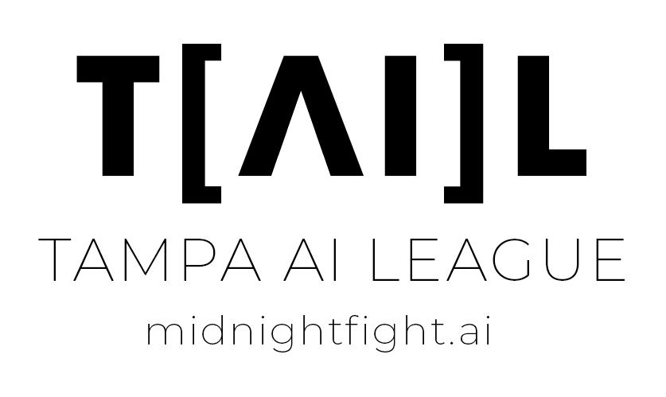
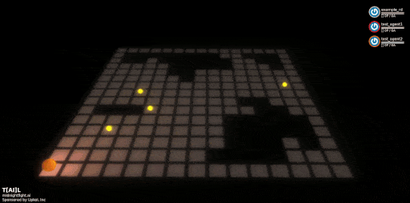
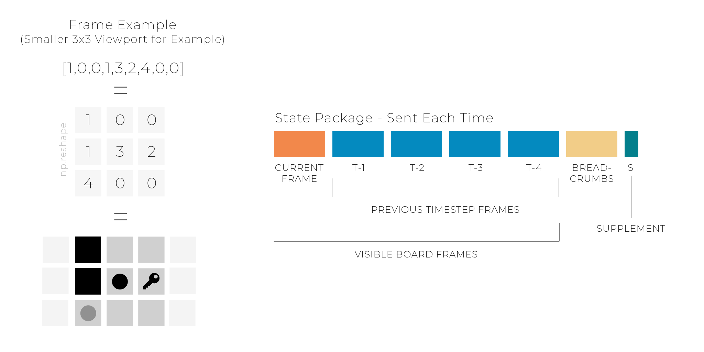
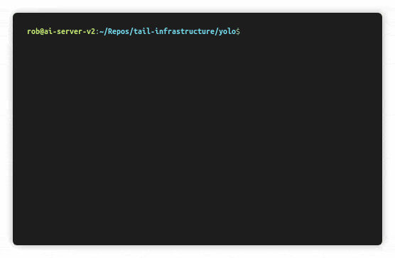
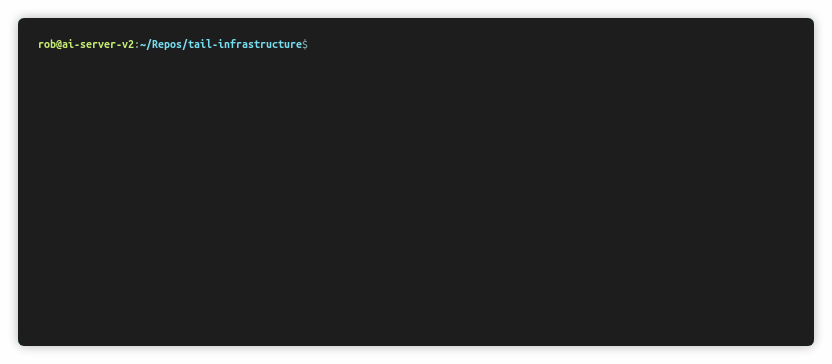

<div  align="center">

<br>

</div>

  

-----------------

  

Tampa AI League is a monthly in-person competition in the format of a tournament played by eight automated agents (bots) in a real-time grid world environment at midnight. The winner of the tournament takes home an Ethereum prize sponsored by local technology companies.

  

Solutions are heavily encouraged to use recent advances in machine learning / reinforcement learning, but any attempts are welcome as long as they meet the specification outlined below. Python is the default language but we're working on supporting others.

  

Use our self-qualification tool to verify your submission can run on our environment (details below). The core execution engine, [SkyPond](https://github.com/upkoi/skypond), and a first game have both been made open source.

  

*  [Game Details](#game-details)

*  [Quick Start](#quick-start)

*  [Prerequisites](#0---prerequisites)

*  [Installation](#1---installation)

*  [Agent Creation](#2---agent-creation)

*  [Testing Locally](#3---testing-locally)

*  [Deployment](#4---deployment)

*  [Important Limitations](#important-limitations)

*  [Rules & Current Game Parameters](#rules--current-game-parameters)

*  [Additional Technical Details](#additional-technical-details)

*  [Questions & Answers](#questions--answers)

*  [Acknowledgments](#acknowledgments)

  

## Game Details

<div  align="center">

<br><br/>

</div>

  

Four keys, representing fragments of an Ethereum private key, are hidden in a maze. Have your agent collect all four keys and you will instantly* be credited the full prize pool. Can't find all four keys? Other agents likely have them and your submission can fight them to win.

  

Players compete in a small custom multi-agent grid world environment, _Four Keys_, optimized for interaction by machine learning agents. The game is displayed live on a projector. We've balanced the game to help machine learning and non-machine learning agents compete on a relatively level field. See below (and on the event page) for current rules and parameters. Entering a competition is completely free.

  

The game is turn-based, and each agent can see a small portion of the board surrounding them, provided in a frame each turn. They are also given several previous frames of activity, a breadcrumb frame indicating where the agent has been, and a supplement containing additional information about the agent movement recharge, attack recharge, and position in the larger grid. Agents are strongly suggested to be completely stateless and rely only on this information.

  

<div  align="center">

<br>

</div>

  

Games take a maximum of one hour to complete and are hands-off after submission. The game execution time is a great time to chat with other machine learning practitioners and software developers in the area.

  

_\*Provide an ethereum address to receive prizes. See below for more information. Depending on the game parameters, there might be several rounds before a winner is declared._

  

## Quick Start

Initial submissions usually can be created in 15-30 minutes by following these instructions on Linux or a Mac. We haven't had a chance to test this on other environments yet.

  

We've open-sourced / MIT licensed the core execution engine, [SkyPond](https://github.com/upkoi/skypond), to allow transparency into the main code that is running the game.

  

### 0 - Prerequisites

* Docker

* Python 3.6

* Linux or OS X

  

The execution environment requires **python 3** (python _3.6 or above_ is strongly suggested for installation simplicity) and a docker installation. It works best on Linux or OS X (due to a dependency on [OpenAI Gym](https://github.com/openai/gym)).

  

Note: Python 2 support is not currently planned.

  

Check your python3 installation with:

```

python3 -V

```

  

Verify your docker installation with:

```

docker run hello-world

```

  

#### OS X: Add /var/folders to whitelist [Required]

Add /var/folders to the "File Sharing" whitelist in docker preferences. This is required so docker can access the temporary directory created by the qualification tool on OS X. If you have a custom temporary directory set, use that instead. Veriy using _echo $TMPDIR_.

  

#### Linux: Verify Non-Root Docker Access

Make sure you can run docker as a non-root user. See [post-installation instructions](https://docs.docker.com/install/linux/linux-postinstall/) for more information. If not, the qualification tool will likely fail to run.

  

Resources

-  [OS X Prerequisite Guide](docs/prerequisites/osx.md)

-  [Alternative Guide to Installing Python3 on OS X](https://wsvincent.com/install-python3-mac/)

-  [Latest Docker Installation Instructions](https://docs.docker.com/install/)

-  [Setting up docker and using WSL](https://nickjanetakis.com/blog/setting-up-docker-for-windows-and-wsl-to-work-flawlessly)
-- Don't follow the directions about changing the root mount

  

### 1 - Installation

  

Pull down this repository and run the included setup tool to get started. This will install all dependencies, including SkyPond.

  

Example:

```

git clone https://github.com/upkoi/tail

cd tail

python3 setup.py install --user

  

```

  

The PyTorch dependency is used for the example training script. If you have trouble installing PyTorch through the automated install try installing it manually with...

  

```

pip3 install torch==1.0.1

```

  

...and then running the setup script above. Note that PyTorch version 1.0.1 is required to line up with the execution environment.

  

#### Post-Installation Setup

  

Optionally, run a self-test of the execution environment after installation with:

  

```

python3 qualify.py --self-test --unrestrict-networking

```
For Windows you'll want to specify the stage-path otherwise there may be issues accessing /tmp

```

python3 qualify.py --self-test --unrestrict-networking --stage-path ./stage

```
  

_Note: The first time the qualification tool is run it will need to pull down the latest execution environment docker image. This may take several minutes._

  
  
  

### 2 - Agent Creation

Use the included create.py script to copy an existing example. All examples are MIT licensed and are provided as inspiration and starting points.

  

We offer a starting point for reinforcement learning agents, _tolstoy_. This is an agent that learns how to find and hold on to keys but doesn't fight often. This agent can be trained in about 20-30 minutes to pass the qualification criteria and is a starting point for modification.

  

Use the create.py script to create a variant of this model...

  

```

python3 create.py --template neural/tolstoy

```

  

Follow the prompts to add a name and an optional Ethereum key for your submission.

  

Once created, cd into the directory and run the included training file.

  

```

cd yolo

python3 train.py

```

  

Notes:

* If you run into issues on OS X with PyTorch related to libshm or libomp try _brew install libomp_

* The training tool might not render the return graph or visualization correctly on some terminal configurations on OS X. We're working on it.

  

<div  align="center">

<br><br>

</div>

  

This will train a new agent on a medium-sized board with one small opponent using PPO ([Proximal Policy Optimization](https://arxiv.org/pdf/1707.06347.pdf)) - a modern reinforcement learning algorithm.

  

The training script will intermittently test your agent on a larger board with several agents to visualize progress. The top two small frames in the visualization stage show part of what your agent sees, including the visible board features (like walls, other players, and keys) and the breadcrumb layer (stateful tracking of the last 1000 movements).

  

This example model uses a deep convolutional neural network and should reach an (okay) average reward of around _9_ in about 10-20 minutes. Feel free to press CTRL+C to stop training at any time after this point.

  

### 3 - Testing Locally

This sample neural network agent includes everything you need to compete, including the required _handler.py_ file that is used to communicate with your submission. An important part of the competition is self-qualification - validating that your submission is ready for battle and doesn't contain significant errors. To self-qualify your submission at any time, run the qualification tool:

  

```

mkdir yolo-ready

python3 qualify.py --agent ./yolo --output ./yolo-ready

```

  

<div  align="center">

<br><br>

</div>

  

This will:

  

- pull down the validation docker image

- start it

- copy your files into it

- attempt to get your submission information

- try to break it by playing simulated rounds of the game against it of increasing difficulty.

  

If successful (and your submission didn't fail any of the tests) the packaging tool will copy your files into a new folder specified by **--output**.

  

Additional Notes:

  

* Use --visualize to render agent progress during qualification. This will slow down the qualification process by a small amount.

* This process is not entirely deterministic yet. Feel free to give marginally failing agents another shot.

  

### 4 - Deployment

Copy the contents of the /output folder onto a floppy disk (or specify your drive path with --output in the first place). Be careful not to copy the folder itself. The root folder on the disk should at least contain the entry.py file and the qualification.dat file and typically also contains an info.json file as well as others.

  

You can validate your packaged submission on your target disk by using **--verify**. Ex:

  

```

python3 qualify.py --verify /media/rob/disk

```

  

__Important Note__: After qualification do not edit any part of your agent, including the name! We hash parts of the agent in the qualification process (subject to change) and changing your agent after qualification might cause it to fail.

  

### 5 - Yeah!

At this point, you know how to create, validate, and package submissions. __We encourage you to check out the other samples and use one as a starting point for creating your own agent.__

  

The final step is to bring your agent to the tournament. Competitions are currently private. Please e-mail rob@upkoi.com to enter. We're opening up competition to the public soon - check [midnightfight.ai](https://www.midnightfight.ai) for availability.

  

### Get Some Hardware

A modern floppy disk drive and set of two or more floppy disks are recommended. Here is a link to the same hardware used in the competition itself:

  

[RAAYOO USB Floppy Disk Drive](https://www.amazon.com/gp/product/B077HDT19H/ref=ppx_yo_dt_b_asin_title_o05_s00?ie=UTF8&psc=1)

  

This drive was approximately $15 as of May 2019.

  

## Important Limitations

  

### Disk Space

The most significant constraint for the competition is a hard limit of all submission content at approximately 1.44MB as all submissions are required to be made in-person at the event on a single 3.5" floppy disk. A backup disk is also recommended as magnetic format media is vulnerable to failure due exposure to excessive heat and significant magnetic fields.

  

This constraint adds a model-compression aspect to some machine learning submissions which may need to be considered during your design. It also helps balance the playing field by preventing very large or complex neural network models.

  

We also like floppy disks.

  

### Python 3 & Libraries

Additionally, the floppy disk must contain a Python 3 file, handler.py, which implements a standardized interface through flask (detailed below and in the _examples_ folder).

  

Your code is run in isolation on a docker image that is preloaded with a standardized set of relevant libraries, including recent versions of:

  

* NumPy

* Pandas

* Scipy

* TensorFlow

* Keras

* PyTorch

* Keras-RL

* TensorForce

* AI Gym

* h5py

* torch-ac

  

See the *docker_image* folder in SkyPond for more information and exact versions.

  

## Rules & Current Game Parameters

The current game, Four Keys, is a custom grid world environment that was designed to be simple to understand and enter, but challenging to master. The initial iteration of the game contains simplified rules which might be expanded in later versions.

  

The game is a maze-like environment with four keys randomly distributed in a (commonly) 15 by 15 or 30 by 30 tile board. Up to eight players start at points on the outside of the board and take turns moving around to locate keys and attack other players while evading an attack. Once picked up by a player, keys are held in inventory until attacked. **The goal is to hold all four keys simultaneously - which concludes a game.** Depending on the exact tournament, games might be played just once or multiple times.

  

Players can attack as well as drop individual keys (potentially as a lure). If hit by another player **while holding keys**, the player loses half of their attack recharge and must also wait eight turns before moving again. The attacking player must wait twenty turns before triggering another attack. Both movement and attack recharge values are private and are not broadcast to other players. Be careful of moving adjacent to other players.

  
  

| Parameter | Value |

| ------------- |:-------------:|

| Game Name | Four Keys |

| Game Version | v1.0 |

| Maximum Players | 8 |

| Minimum Players Needed | 2 |

| Competition Board Size | 30 x 30 (900 Squares) |

| Observable Board Size | 7x7 (49 Squares) |

| Win Condition | A single agent obtains all four keys. |

| Attack Range | 1 Square (Adjacent) |

| Attack Recharge | 20 Turns |

| Attack Movement Penalty (Once Hit - If Holding Keys) | Drop all keys and wait for eight turns before movement. Lose half of attack recharge. |

| Key Drop Logic | First randomly selected open tile. This is an important distinction that may result in unexpected behavior in close-quarter combat in narrow corridors or mazes. |

| Time Limit | 60 Minutes |

| Tie Resolution | In the event of a tie, victory will go to the player that was able to obtain a key earliest in the game. |

  

The processing of invalid actions is subject to the discretion of the execution environment. Most invalid actions will result in no action - effectively the loss of a turn.

  

If an agent is disqualified or unreachable during play, the agent will take the most passive action possible, usually standing still on the game board. This is generally not optimal as not moving is an excellent way to get attacked by other players.

  

All permissible behavior, given the constraints, including permanently blocking/neutralizing other players is allowed. We only ask that you try not to deliberately disrupt the game by intentionally taking down the execution environment.

  

## Additional Technical Details

This is a detailed summary of what the executing environment looks like, what is expected from your submission, and a summary of how the platform works from a technical perspective. See the [SkyPond](https://github.com/upkoi/skypond) project for the core execution environment.

  

### Qualification Token

When you pass self-qualification - using the qualification tool above - a qualification.dat file will be generated for your agent. This is a _low security_ token to indicate your current agent passed qualification and needs to be on your submission at time of submission. Do not modify any part of your agent after qualification or it's possible that the execution engine will reject your submission. If you need to make further changes, be sure to re-qualify your submission.

  

You can check if a packaged submission will pass qualification at any time by using

  

```

python3 qualify.py --verify [agent path]

```

  

### Entry File

The primary required file is **handler.py**. This must contain a flask app exposing two routes:

  

* /information

* /react

  

There are working versions of the routes in the _examples_ folder, and it's strongly recommended that you copy an existing sample to start.

  

As long as you implement these methods to spec in some capacity, we should be able to (at least attempt to) validate your submission.

  

#### GET /information

This is generally only called when your submission is first loaded (this is done automatically when your disk is entered). It retrieves your display name, a description, an e-mail address (used to look up a gravatar to be displayed on the screen with this other information during the competition), and an Ethereum address of where to send the prize money if your agent wins. The transfer happens automatically at the end of the tournament.

  

In the sample files, this information is stored in a JSON configuration file and is forwarded back when the route is called.

  

#### POST /react

This method is called each time the game requires an action from your bot. We strongly encourage a completely stateless implementation. A substantial amount of game state is passed in to help make stateless agents viable. See the example folder for more details.

  

Note that this method is also called several times after your bot is loaded to ensure it works.

  

### Execution Resources & Parameters

* Your bot, during the competition, is given approximately 500ms to return a result through the _react_ method.

  

* Specific hardware resources might vary but expect approximately one 2ghz CPU core and 1GB of memory should be available.

  

* Your environment will not have access to the internet and will likely appear to be offline.

  

* Your environment may be restarted/reinitialized during the game.

  

* You should not rely on the file system to store information across restarts. Any saved information will be removed.

  

A failure to use those resources to return a result in the allowed time will result in a passive action taken on your behalf, which will likely involve your bot not moving and being vulnerable to attack.

  

It's strongly recommended that you test your code on a resource-constrained environment by using the qualification tool. It's also encouraged to wrap your main logic or model forward call in a try ... except block and default to a safe action if it fails.

  

### In-Game Disqualification

The main goal of the execution environment is to keep the game going. If your agent is repeatedly timing / erroring out, or uses excessive resources out of turn, your submission might be automatically disqualified to help keep the game moving forward. For this reason, it's highly recommended to have a simple, stateless implementation that quickly returns a response to the _react_ method.

  

## Questions & Answers

### Can my submission use the internet?

A: Nope. Your execution environment is held offline.

  

### It's 2019, why am I using a floppy disk drive?

A: 1.44MB is a great equalizer. It's relatively simple to take larger off the shelf models and libraries and adapt them to fit the execution model here, but that's not as much of a real challenge as writing your own code or learning how to do model compression to get a robust algorithm to run in a resource-constrained environment. By placing a significant constraint on total size, we place competitors on a more equal footing.

  

### Why Four Keys? What are other game formats under consideration?

A: We wanted to make a multi-agent game that was easy to learn but difficult to master. This game is a work in progress and the specific rules, and game dynamics might evolve over time. However, the exact rules and a qualifying game engine will be published well advance of the competition.

  

### Do I have to use the packaging tool?

A: Technically no. Feel free not to use it to verify or test out your submission. However, it will help ensure that your submission won't be rejected at the start of the tournament (a similar validation check happens automatically) and we strongly recommend it.

  

### Do I need to use a neural network?

A: Not at all. Alternative solutions are allowed and encouraged. We attempted to provide enough stateful information to make it easy for both hardcoded as well as reinforcement learning agents to perform well. We're partial towards reinforcement learning and modern algorithms such as A3C as they can rapidly learn the game.

  

### Are there any age requirements?

Due to our current venue, we request that you be 21 or older. We might relax that requirement in the future.

  

### I'm lazy / tired, can I just e-mail you a zip file?


  

### Does the execution environment have a GPU?

A: No, to simplify execution your model must forward on CPU only. This shouldn't be an issue given the file size limitation effectively limiting the number of model parameters.

  

### Are teams allowed? How do we submit a team entry?

A: Feel free to submit an entry as a team. If you are submitting on behalf of an organization, then it's encouraged that you use or incorporate your organization name in name field (which ultimately is displayed on the screen during the competition). Also, feel free to submit multiple agents that work together given the environment. However, each submission needs to be delivered in person and we ask that the agent names share a common prefix or element to help identify them as teams. To share the prize, have both agents contain the same target Ethereum address.

  

### Are there plans to support other languages? How was python selected?

A: Python is a great language for building machine learning solutions (it's the most popular language for data science as of 2019). One of the contributing reasons is the corresponding rich ecosystem of libraries that accelerate machine learning development. See above for the available libraries on the execution environment. It's also a popular language in general, [scoring high on the 2018 stack overflow developer survey](https://insights.stackoverflow.com/survey/2018/#technology-programming-scripting-and-markup-languages). Additionally, it's a speedy language to pick up, we encourage developers in other languages to give it a whirl.

  

That said, there are plans to eventually add first class support for JavaScript, C#, and Julia.

  

### Can you add x package to the base execution environment?

A: Changes to the execution environment are carefully considered as they have the potential to change the game dynamics considerably. Part of the challenge is to do well given limited resources. That said, send requests for environment updates to rob@upkoi.com, and if enough requests come in for a given package, we'll consider integrating it. For now, try including the package - and any dependencies - in your submission. This is challenging for some (more substantial) libraries but possible for others.

  

### Can you open source the parent competition-time execution environment and display?

A: There's a chance we'll eventually open-source additional parts of the parent competition-time orchestration logic. For now, all of the essentials are included in SkyPond.

  

### I live in another city, can I participate?

A: Absolutely. There are daily [cheap non-stop flights](https://www.google.com/flights) to Tampa from many cities (including New York and San Francisco) and competitors from anywhere in the world are welcome. It's encouraged to secure a spot in the primary competitor list on the Eventbrite page before booking tickets or securing accommodations (use the registration link on the homepage). Come out to Tampa Bay and eat a Cuban sandwich while battling your fellow ML practitioners.

  

### What happens if my submission is not accepted by the execution environment on the day of the event? How does the wait list work?

A: Competitors are encouraged to arrive at least 30 minutes before the competition. At least 15 minutes before the game, the execution environment is started and submissions are automatically validated. Solutions that don't pass the validation phase have until the minute before the competition start time to make adjustments and pass validation. If there are any competitors in the wait list the minute before the competition then they are swapped in instead (time permitting). The game automatically starts at midnight.

  

Competitors on the wait list are swapped in at the final minute before the competition starts to replace no-shows or agents that failed validation. Submissions on the wait list are processed in the order received.

  

### How private is my submission? How is intellectual property handled?

A: We will not share your submitted code and will (likely) never look at it.

  

Generally, your submitted code is used for the competition and is permanently removed from the execution environment shortly after the game ends. In the rare event that there is a severe problem with the execution environment that appears to be from malicious intent, submissions might be evaluated privately.

  

If you'd like more information, please feel free to e-mail rob@upkoi.com.

  

## Acknowledgments

Both TAIL and SkyPond build on top of the work of talented machine learning practitioners and companies from around the world.

  

The competition and core execution were inspired and influenced by presentations, conversations, and related competitions at [NeurIPS](https://nips.cc/) 2018, [MLConf](https://mlconf.com/), and [Kaggle Days](https://kaggledays.com/) SF 2019.

  

See [SkyPond Acknowledgments](https://github.com/upkoi/skypond#acknowledgments) for more information.